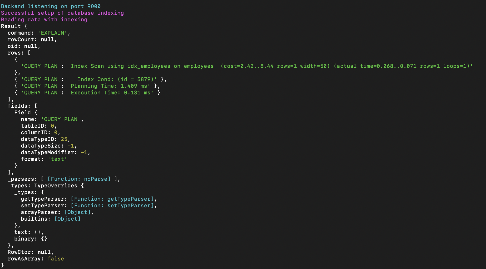
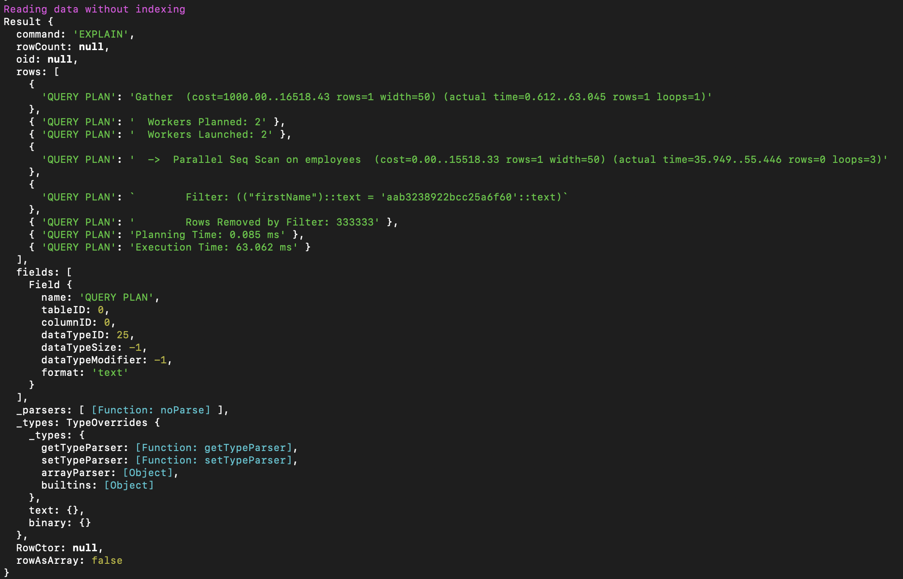
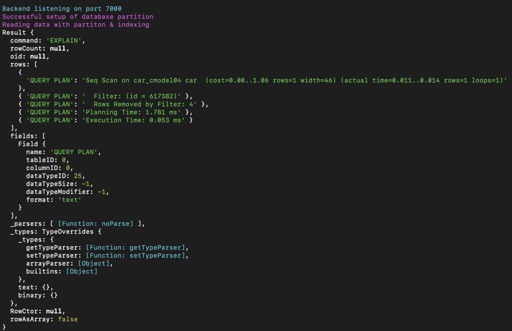
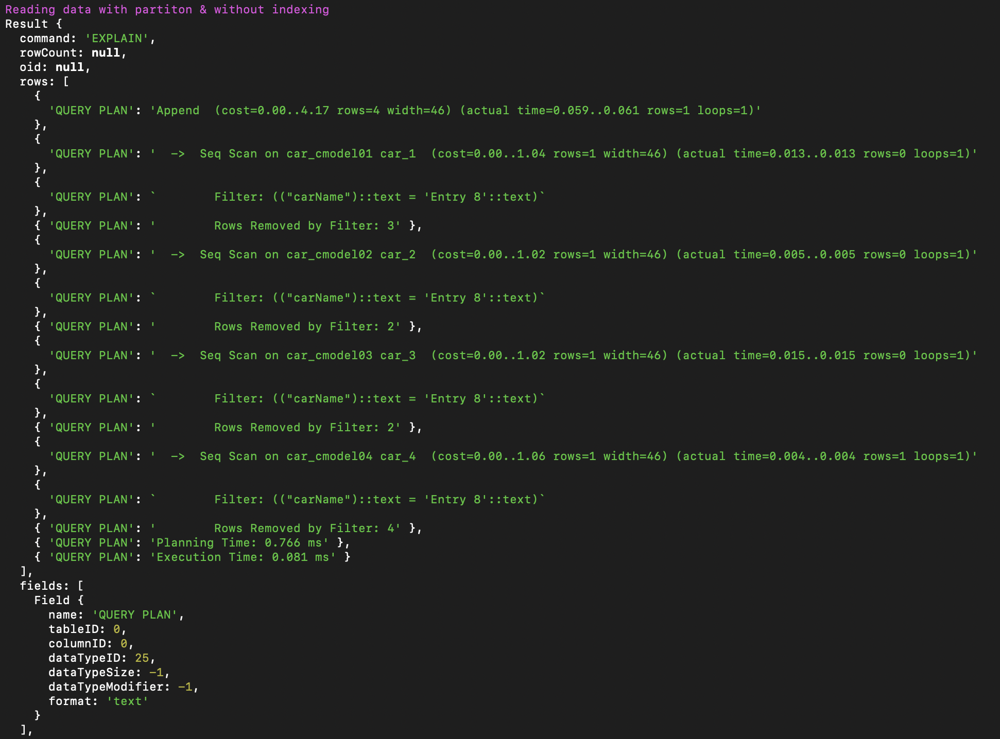
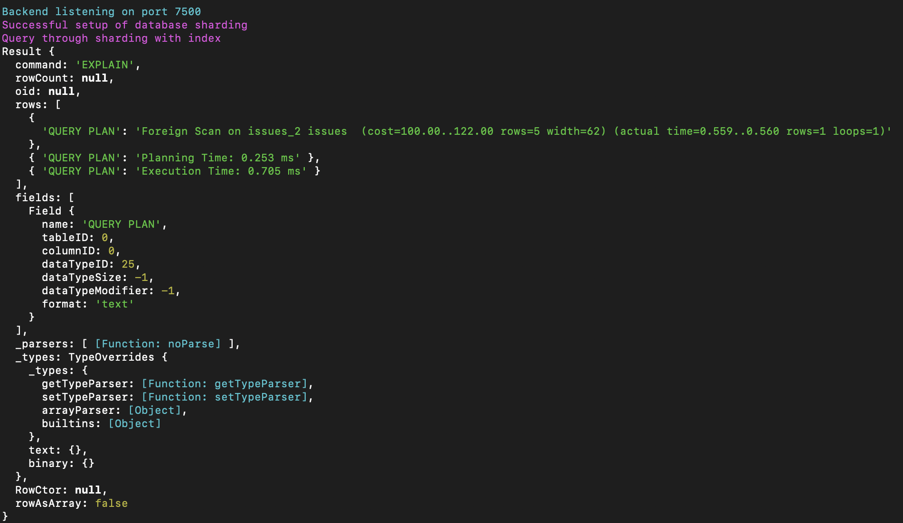
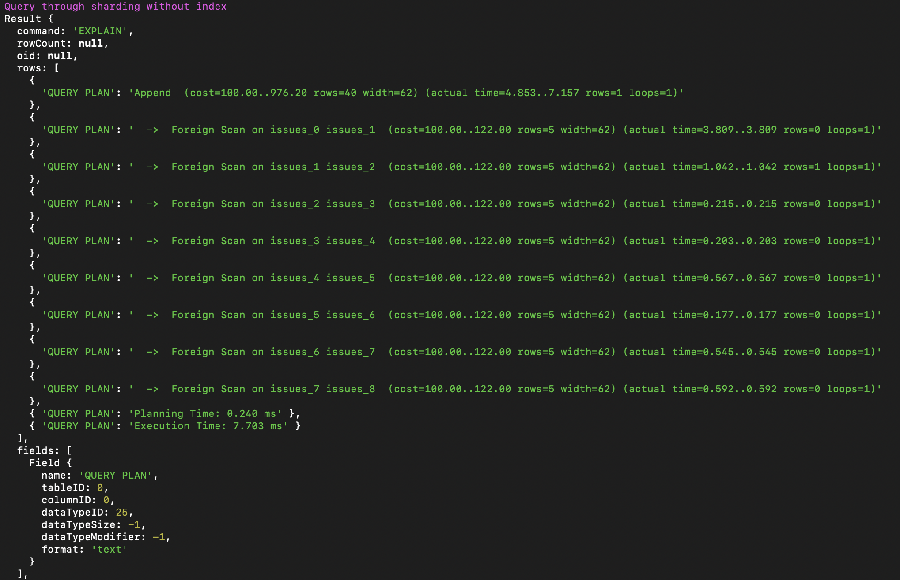

# Database Scalability & different approaches using PostgreSQL

*Database scalability is the ability to scale out or scale up a database to allow it to hold increasing amounts of data without sacrificing performance.*

For relational databases, the typical approach is to **shard the database** and distribute it across multiple servers in a cluster. However, before sharding the database (which is a comparatively complex approach) there are methods with which you can scal database including indexing, partitioning, replication and sharding. 

I will be covering the in-depth of each in a separate blog. This repository deals with the implementation of each indexing, partitioning and sharding using postgres (and pgadmin4).

Within the codebase replace the `OWNER to aemiej` with your username in postgres as `OWNER to <username>`. Within `indexing.js`, `partition.js`, and `sharding.js`, replace the pool settings based on your postgres settings.

```
$ npm install
```

## 1. Indexing 

```
$ npm run index
```

In the browser, locate to `localhost:9000`, within the terminal it will show the message **successfull setup** if the setup is successful. After this, you can analyze the power of indexing by querying the database using indexed param and non-indexed param. Locate to `localhost:9000/app/v1/analyze-indexing` for analysing and you'll receive the following output. 

### Data Read With Indexing


### Data Read Without Indexing


Later this, locate to `localhost:9000/app/v1/delete` for successful deletion of the entire setup of indexing with postgres.

## 2. Partition

```
$ npm run partition
```

In the browser, locate to `localhost:7000`, within the terminal it will show the message **successfull setup** if the setup is successful. After this, you can analyze the power of partition along with indexing by querying the database using indexed param and non-indexed param. Locate to `/app/v1/analyze-partition` for analysing and you'll receive the following output. 

### Data Read With Partition & Indexing


### Data Read With Partition & Without Indexing


Later this, locate to `localhost:7000/app/v1/delete` for successful deletion of the entire setup of partition with postgres.

## 3. Sharding

Within the `psql/sharding/foreign-wrapper.sql` you must make the respective changes to add the username and password for the roles that are present within your postgres.

For instance: 
```
CREATE USER MAPPING IF NOT EXISTS
for <username> SERVER shard1 OPTIONS (user <username>,
                                         password <password>);
```

After this, run in your terminal: 

```
$ npm run sharding
```

In the browser, locate to `localhost:7500`, within the terminal it will show the message **successfull setup** if the setup is successful. After this, you can analyze the power of sharding (quite complex) along with indexing & partitions by querying the database using indexed param and non-indexed param. Locate to `localhost:7500/app/v1/analyze-sharding` for analysing and you'll receive the following output. 

### Data Read With Sharding (Partition & Indexing)


### Data Read With Sharding (Partition & Without Indexing)


Later this, locate to `localhost:7500/app/v1/delete` for successful deletion of the entire setup of sharding with postgres.